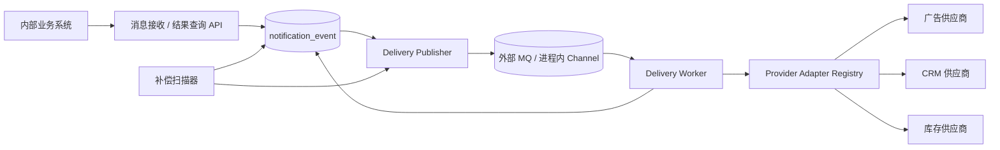
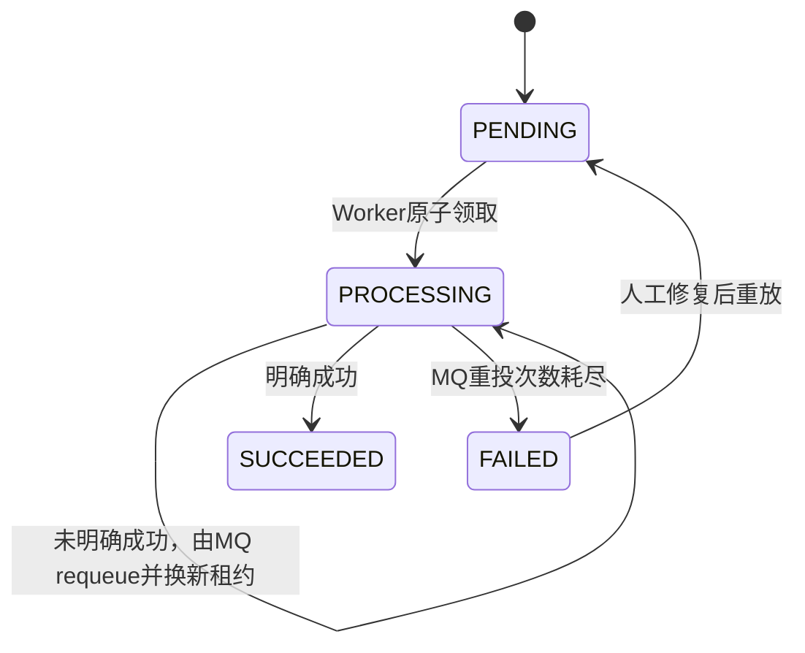

# 可靠外部通知投递服务设计

## 1. 问题理解

企业内部多个业务系统会在关键业务事件发生后调用外部供应商的 HTTP(S) API，例如通知广告、CRM 或库存系统。不同消息可以选择不同供应商，但一条消息只能投递给一个供应商、执行一个供应商动作。

本系统的职责是把业务系统提交的消息可靠地持久化，并异步投递到该消息指定的外部供应商。业务系统不等待供应商响应；本系统在消息持久化成功后接管后续投递、重试和异常处理责任。

### 1.1 核心约束

- 系统支持多个外部供应商。
- 每条消息只指定一个 `provider_code` 和一个 `provider_action`。
- 一条消息只产生一个外部 HTTP 请求，不进行一对多广播。
- 不解决跨供应商事务、部分成功、补偿编排等问题。
- 业务消息使用 `source_system + source_request_id` 保证内部受理幂等。
- 不要求外部供应商支持 `Idempotency-Key`。
- PostgreSQL 是消息状态的唯一事实来源。
- MQ 只负责通知 Worker 有待处理任务，消息体只包含 `event_id`。
- 系统面向稳定投递，不提供频繁变化的动态流程编排能力。

### 1.2 系统边界

系统负责：

- 请求认证和基础参数校验。
- 内部业务请求幂等。
- 供应商及动作合法性校验。
- 消息持久化。
- 异步 MQ 发布。
- 外部 HTTP 请求构造和发送。
- 超时、重试、限流、租约恢复和失败记录。
- 对无法确定外部处理结果的消息进行显式标记。
- 基于 `source_request_id` 查询消息处理状态及经过脱敏的供应商响应。

系统不负责：

- 一条消息向多个供应商投递。
- 跨供应商分布式事务。
- 外部供应商侧的恰好一次处理。
- 通用工作流、事件编排或动态脚本执行。
- 在数据库中维护复杂的路由、模板和供应商版本体系。

## 2. 整体架构与核心设计



### 2.1 组件职责

| 组件 | 职责 |
|---|---|
| 消息接收 / 结果查询 API | 幂等受理消息；按来源系统和 `source_request_id` 返回处理结果 |
| PostgreSQL | 保存完整业务消息、唯一投递状态及供应商响应 |
| Delivery Publisher | 将待处理记录的 `event_id` 发布到外部 MQ 或进程内 Channel |
| 外部 MQ / 进程内 Channel | 外部 MQ 支持解耦和独立扩容；Channel 用于轻量单进程部署 |
| Delivery Worker | 原子领取任务、选择适配器、调用供应商、更新结果 |
| Provider Adapter Registry | 根据 `provider_code + provider_action` 选择固定转换逻辑 |
| 补偿扫描器 | 处理待发布消息、到期重试以及 Worker 租约过期 |

### 2.2 一条消息的处理流程

1. 业务系统提交 `source_system`、`source_request_id`、`provider_code`、`provider_action` 和 `payload`。
2. API 校验供应商和动作是否存在，并校验 Payload 是否符合该动作的输入要求。
3. API 使用 `source_system + source_request_id` 进行幂等检查。
4. API 将消息以 `PENDING` 状态写入 `notification_event`。
5. PostgreSQL 提交成功后，API 返回 `202 Accepted`。
6. 事务提交后，API 将该记录的 `event_id` 交给 Publisher；外部 MQ 模式发布到 Broker，`memory` 模式非阻塞写入进程内 Channel。数据库扫描负责补偿未成功保留的通知。
7. Worker 收到 `event_id` 后，从 PostgreSQL 加载完整消息并原子领取。
8. Worker 根据 `provider_code + provider_action` 选择适配器，生成供应商 HTTP 请求。
9. Worker 保存经过限制和脱敏的供应商响应；明确成功时更新为 `SUCCEEDED`，其余结果保持 `PROCESSING` 并由 MQ requeue，达到 `max_attempts` 后标记为 `FAILED`。
10. Worker 完成数据库更新后再 ACK 外部 MQ 消息；`memory` 模式则结束本次 Channel 消费。

## 3. 数据库设计

系统只保留一张核心表。一行表示一个业务请求向一个供应商执行一次指定动作。

```sql
CREATE TABLE notification_event (
    -- 系统内部事件及投递ID
    id                  UUID PRIMARY KEY,

    -- 来源系统及来源系统中的幂等请求ID
    source_system       VARCHAR(64) NOT NULL,
    source_request_id   VARCHAR(128) NOT NULL,

    -- 一条消息唯一指定的供应商和供应商动作
    provider_code       VARCHAR(64) NOT NULL,
    provider_action     VARCHAR(64) NOT NULL,

    -- 标准业务数据
    payload             JSONB NOT NULL,

    -- PENDING、PROCESSING、SUCCEEDED、FAILED、UNKNOWN
    status              VARCHAR(16) NOT NULL DEFAULT 'PENDING'
                        CHECK (status IN (
                            'PENDING',
                            'PROCESSING',
                            'SUCCEEDED',
                            'FAILED',
                            'UNKNOWN'
                        )),

    attempt_count       SMALLINT NOT NULL DEFAULT 0,
    next_attempt_at     TIMESTAMPTZ NOT NULL DEFAULT now(),

    -- 最近一次成功发布到MQ的时间
    enqueued_at         TIMESTAMPTZ,

    -- Worker处理租约
    lease_token         UUID,
    lease_until         TIMESTAMPTZ,

    -- 只保存最后一次投递结果或当前处理阶段
    last_result         JSONB,

    -- 供应商最近一次明确返回的HTTP响应
    provider_response   JSONB,

    created_at          TIMESTAMPTZ NOT NULL DEFAULT now(),
    updated_at          TIMESTAMPTZ NOT NULL DEFAULT now(),

    -- 一个来源系统中的一个业务请求只能受理一次
    UNIQUE (source_system, source_request_id)
);
```

只建立支撑核心流程的索引：

```sql
-- 待发布、到期重试任务
CREATE INDEX ix_notification_event_pending
ON notification_event (
    next_attempt_at,
    enqueued_at
)
WHERE status = 'PENDING';

-- Worker崩溃后的租约恢复
CREATE INDEX ix_notification_event_expired
ON notification_event (lease_until)
WHERE status = 'PROCESSING';

-- 按供应商和动作查看积压及失败
CREATE INDEX ix_notification_event_provider_action
ON notification_event (
    provider_code,
    provider_action,
    status,
    updated_at
);
```

### 3.1 `last_result` 与 `provider_response`

两个字段的职责不同：

| 字段 | 内容 |
|---|---|
| `last_result` | 内部执行阶段、错误代码、是否等待 requeue、耗时和尝试次数 |
| `provider_response` | 供应商最近一次明确返回的 HTTP 状态码和经过脱敏、截断的响应内容 |

`provider_response` 使用统一 JSON 结构：

```json
{
  "http_status": 200,
  "content_type": "application/json",
  "body": {
    "success": true,
    "provider_request_id": "vendor-request-789"
  },
  "received_at": "2026-08-15T10:30:01.861+08:00",
  "truncated": false
}
```

约束：

- 只保存最后一次明确收到的供应商响应，不保存完整调用历史。
- 只保存允许列表中的响应 Header；默认不保存 Cookie、认证信息等 Header。
- JSON 响应以 JSON 保存，文本响应以字符串保存。
- 二进制响应不保存正文，只保存内容类型、长度和摘要。
- 响应正文必须设置大小上限；超过上限时截断并设置 `truncated=true`。
- 每次 Worker 开始新的尝试时先清空旧值；本次尝试未收到响应的连接失败或超时，`provider_response` 保持 `NULL`，不伪造或混用此前尝试的供应商结果。

### 3.2 幂等规则

唯一键为：

```text
source_system + source_request_id
```

重复提交时：

- 如果供应商、动作和 Payload 与原记录一致，返回原 `event_id`，并标记 `duplicate=true`。
- 如果同一个幂等键对应不同供应商、不同动作或不同 Payload，返回 `409 Conflict`。
- 如果同一个业务事实需要产生两次独立投递，来源系统必须生成两个不同的 `source_request_id`。

唯一键故意不包含 `provider_code`，防止业务方使用同一个请求 ID 改变目标供应商，从而绕过一条消息只投递一次的约束。

## 4. 通讯协议

所有 JSON 接口统一返回 `status`、`data` 和 `error_message`。成功时数字 `status=0`、`error_message=""`；失败时保留正确的 HTTP `4xx/5xx` 状态码，并在 `status` 中返回数字业务错误码。错误响应的 `data` 为 `{}`，`error_message` 根据请求头 `Accept-Language` 自动选择中文或英文，未提供或无法识别时默认英文。Swagger 静态资源和 `/docs` 跳转不使用该 JSON 包络。

Bearer Token 只验证调用方是否可以访问 API，不与 `source_system` 绑定。`auth.tokens` 配置一个或多个有效 Token；若没有任何非空 Token，Server 启动时自动生成一个并通过日志输出。Swagger 使用实际生效的第一个 Token。

### 4.1 业务系统接入协议

```http
POST /v1/messages
Authorization: Bearer <internal-token>
Content-Type: application/json
```

```json
{
  "source_system": "billing-system",
  "source_request_id": "payment-20260815-000123",
  "provider_code": "crm-vendor-a",
  "provider_action": "update_contact_status",
  "payload": {
    "subscription_id": "sub-456",
    "contact_id": "contact-123",
    "status": "PAID",
    "amount": 19900,
    "currency": "CNY",
    "occurred_at": "2026-08-15T10:30:00+08:00"
  }
}
```

`provider_code + provider_action` 决定 Payload 校验规则和外部接口转换逻辑。例如：

```text
crm-vendor-a + update_contact_status
inventory-vendor-b + set_inventory
advertisement-vendor-c + report_registration
```

业务系统不能提交任意 URL、认证 Header 或供应商密钥。

受理成功：

```http
HTTP/1.1 202 Accepted
```

```json
{
  "status": 0,
  "data": {
    "event_id": "64b19467-fc14-4858-91f8-042e8c78eec8",
    "source_system": "billing-system",
    "source_request_id": "payment-20260815-000123",
    "status": "PENDING",
    "duplicate": false,
    "accepted_at": "2026-08-15T10:30:01.152+08:00"
  },
  "error_message": ""
}
```

幂等重复：

```json
{
  "status": 0,
  "data": {
    "event_id": "64b19467-fc14-4858-91f8-042e8c78eec8",
    "source_system": "billing-system",
    "source_request_id": "payment-20260815-000123",
    "status": "PENDING",
    "duplicate": true,
    "accepted_at": "2026-08-15T10:30:01.152+08:00"
  },
  "error_message": ""
}
```

幂等键冲突：

```http
HTTP/1.1 409 Conflict
```

```json
{
  "status": 1006,
  "data": {},
  "error_message": "The source request was previously accepted with different content."
}
```

供应商或动作不支持：

```http
HTTP/1.1 422 Unprocessable Entity
```

```json
{
  "status": 1004,
  "data": {},
  "error_message": "The provider or provider action is not supported."
}
```

如果 PostgreSQL 未能可靠提交，必须返回 `503 Service Unavailable`，不能返回 `202`。

### 4.2 处理结果查询接口

业务系统使用原始 `source_request_id` 查询处理结果：

```http
GET /v1/messages/payment-20260815-000123?source_system=billing-system
Authorization: Bearer <internal-token>
Accept: application/json
```

`source_request_id` 只保证在一个来源系统内唯一，因此调用方必须同时提供 `source_system`，实际查询条件是：

```sql
SELECT
    id,
    source_system,
    source_request_id,
    provider_code,
    provider_action,
    status,
    attempt_count,
    last_result,
    provider_response,
    created_at,
    updated_at
FROM notification_event
WHERE source_system = :source_system
  AND source_request_id = :source_request_id;
```

处理成功：

```http
HTTP/1.1 200 OK
```

```json
{
  "status": 0,
  "data": {
  "event_id": "64b19467-fc14-4858-91f8-042e8c78eec8",
  "source_system": "billing-system",
  "source_request_id": "payment-20260815-000123",
  "provider_code": "crm-vendor-a",
  "provider_action": "update_contact_status",
  "status": "SUCCEEDED",
  "attempt_count": 1,
  "last_result": {
    "outcome": "SUCCEEDED",
    "http_status": 200,
    "latency_ms": 611,
    "attempt_number": 1,
    "finished_at": "2026-08-15T10:30:01.861+08:00"
  },
  "provider_response": {
    "http_status": 200,
    "content_type": "application/json",
    "body": {
      "success": true,
      "provider_request_id": "vendor-request-789"
    },
    "received_at": "2026-08-15T10:30:01.861+08:00",
    "truncated": false
  },
  "created_at": "2026-08-15T10:30:01.152+08:00",
  "updated_at": "2026-08-15T10:30:01.861+08:00"
  },
  "error_message": ""
}
```

尚未完成时同样返回 `200 OK`，以 `data.status` 表达当前处理状态：

```json
{
  "status": 0,
  "data": {
  "event_id": "64b19467-fc14-4858-91f8-042e8c78eec8",
  "source_system": "billing-system",
  "source_request_id": "payment-20260815-000123",
  "provider_code": "crm-vendor-a",
  "provider_action": "update_contact_status",
  "status": "PROCESSING",
  "attempt_count": 1,
  "last_result": {
    "phase": "REQUESTING",
    "started_at": "2026-08-15T10:30:01.250+08:00"
  },
  "provider_response": null,
  "created_at": "2026-08-15T10:30:01.152+08:00",
  "updated_at": "2026-08-15T10:30:01.250+08:00"
  },
  "error_message": ""
}
```

`FAILED` 和 `UNKNOWN` 也返回 `200 OK`，业务处理结果由响应体中的 `data.status` 表达。只有没有找到对应请求时返回：

```http
HTTP/1.1 404 Not Found
```

```json
{
  "status": 1007,
  "data": {},
  "error_message": "No message was found for the source request."
}
```

### 4.3 Provider 能力发现接口

智能体或 MCP 工具使用以下接口查询当前运行实例真实启用的 Provider 能力：

```http
GET /v1/providers
Authorization: Bearer <internal-token>
Accept: application/json
```

返回值直接来自启动时构建完成的 Provider Registry，并按 `provider_code` 和 `provider_action` 稳定排序。中文描述由各 Adapter 在自身 Config 中维护，不单独复制一份静态清单：

```json
{
  "status": 0,
  "data": {
    "providers": [
      {
        "provider_code": "lark-bot",
        "actions": [
          {
            "provider_action": "send",
            "description": "向机器人所在群会话发送文本、富文本、图片、群名片或消息卡片；非幂等"
          }
        ]
      }
    ]
  },
  "error_message": ""
}
```

该接口只描述当前支持的 Provider/Action 及功能语义，不暴露 Webhook、凭据、内部 URL、限流参数等运行配置。

### 4.4 Swagger API 调试页面

Swagger 默认关闭。设置环境变量 `SWAGGER_ENABLED=true` 后，服务会在 `/docs` 路径启用 Swagger UI 和 OpenAPI 文档。开发环境的 `dev/docker-compose.yaml` 已显式开启该变量。

服务启动后可以打开：

```text
http://localhost:8877/docs
```

页面会列出存活检查、就绪检查、消息提交和消息状态查询接口，并支持直接执行请求。Swagger UI 默认把实际生效的第一个 Token 填入 `BearerAuth`，发送请求时自动补全 `Bearer` 前缀。也可以点击页面右上角的 `Authorize` 手动替换为其他已配置 Token。

默认请求体为：

```json
{
  "payload": {
    "msg_type": "text",
    "content": {
      "text": "Notification Delivery test"
    }
  },
  "provider_action": "send",
  "provider_code": "lark-bot",
  "source_request_id": "lark-bot-send-request-id-uuid4",
  "source_system": "example-system"
}
```

其中 `lark-bot/send` 的默认示例使用飞书官方 `msg_type=text + content.text` 结构，可以直接通过本服务的 Payload 校验。

OpenAPI 原始文档也可以通过 `GET /docs/doc.json` 获取。接口结构或注解变化后，在仓库根目录重新生成并提交 `docs/`：

```bash
go run github.com/swaggo/swag/cmd/swag@v1.16.4 init \
  -g main.go \
  -d cmd/server,internal/api \
  -o docs \
  --parseInternal
```

### 4.5 投递通知协议

外部 MQ 消息体只包含内部 `event_id`；`memory` 模式在 Channel 中直接传递同一个 UUID：

```json
{
  "event_id": "64b19467-fc14-4858-91f8-042e8c78eec8"
}
```

以下信息不重复放入 MQ：

- `source_system`
- `source_request_id`
- `provider_code`
- `provider_action`
- `payload`

Worker 根据 `event_id` 从 PostgreSQL 读取这些信息，避免 MQ 与数据库出现两份不一致的数据。

如果 MQ 产品支持原生消息标识，可以直接使用 `event_id`：

```text
RabbitMQ message_id = event_id
Kafka message key    = event_id
RocketMQ keys        = event_id
```

消息不再单独生成 `message_id`。投递实现可以替换，业务协议不绑定具体产品。

## 5. 供应商配置与适配器

供应商信息不进入 `notification_event`，而是放在受控配置文件或配置中心。真实 Token、密码和证书放入密钥管理系统，配置中只保存引用。

```yaml
providers:
  crm-vendor-a:
    base_url: https://crm.vendor.example
    credential_ref: vault://notification/crm-vendor-a
    actions:
      update_contact_status:
        path: /v2/contacts/status
        timeout_ms: 5000
        requests_per_second: 100
        max_concurrency: 20
  inventory-vendor-b:
    base_url: https://inventory.vendor.example
    credential_ref: vault://notification/inventory-vendor-b
    actions:
      set_inventory:
        path: /v1/inventory
        timeout_ms: 3000
        requests_per_second: 200
        max_concurrency: 30

  lark-bot:
    # Lark 的认证语义与 Bearer Token 不同：这是可选的机器人签名密钥。
    signing_secret_ref: vault://notification/lark-bot-signing-secret
    actions:
      send:
        webhook_url: https://open.larksuite.com/open-apis/bot/v2/hook/00000000-0000-0000-0000-000000000000
        timeout_ms: 5000
        requests_per_second: 5
        max_concurrency: 5
        circuit_breaker:
          failure_threshold: 5
          open_duration: 30s
```

`providers` 根节点只负责按 `provider_code` 路由原始 YAML。每个 Adapter 必须实现自己的 `Config`：使用私有配置结构严格解码、校验供应商专属规则，并转换为 Worker 需要的运行参数。不同 Adapter 不共享一套全局 `ProviderConfig/ActionConfig` YAML Schema。例如：

- CRM 使用 `credential_ref + path`，并把 HTTP Method 固定为 `PATCH`。
- 库存适配器把 Method 固定为 `PUT`，独立定义 `set_inventory` 的配置结构。
- 飞书机器人使用其专属的 `signing_secret_ref + webhook_url`，签名密钥可选；Payload 使用官方 `msg_type + content/card` 格式，支持文本、富文本、图片、群名片和消息卡片。适配器执行 20 KB 请求体与 5 次/秒配置上限；只有 HTTP 200 且 `code=0` 才确认成功。

严格解码会在启动阶段拒绝拼错字段或把一个 Adapter 的字段复制给另一个 Adapter。HTTP Method、认证语义和幂等规则属于 Adapter 代码，不允许由 YAML 任意改变。

每个适配器负责：

1. 定义并校验自己的 Config 规则。
2. 将标准 Payload 转换成指定供应商动作要求的 URL、Header 和 Body。
3. 判断供应商是否明确成功，并为未成功结果提供可观测的错误代码和摘要。

系统不提供任意脚本执行能力。新增供应商或动作应通过受控配置和经过测试的适配器完成。

## 6. 状态机与处理规则



状态含义：

| 状态 | 含义 |
|---|---|
| `PENDING` | 等待首次发布或首次被 Worker 领取 |
| `PROCESSING` | 已进入处理生命周期；可能由 Worker 持有租约执行，也可能正在等待 MQ requeue |
| `SUCCEEDED` | 已收到明确成功结果 |
| `FAILED` | 供应商发送未成功并达到真实供应商调用 `max_attempts` |
| `UNKNOWN` | 仅为兼容历史数据保留；当前自动投递流程不再写入该状态 |

### 6.1 Worker 原子领取

```sql
UPDATE notification_event
SET
    status = 'PROCESSING',
    attempt_count = attempt_count + 1,
    lease_token = :lease_token,
    lease_until = now() + interval '60 seconds',
    last_result = jsonb_build_object(
        'phase', 'CLAIMED',
        'claimed_at', now()
    ),
    provider_response = NULL,
    updated_at = now()
WHERE id = :event_id
  AND (
      (status = 'PENDING' AND next_attempt_at <= now())
      OR (
          status = 'PROCESSING'
          AND lease_token IS NULL
          AND last_result->>'outcome' = 'REQUEUE_REQUESTED'
      )
  )
RETURNING *;
```

首次投递执行 `PENDING → PROCESSING`；requeue 投递在 `PROCESSING` 内取得一个新租约。两种领取都会原子递增 `attempt_count`。返回零行表示消息已经被其他 Worker 领取或已经完成，当前重复 MQ 消息可以 ACK。

### 6.2 发起外部请求前

在真正调用供应商前，记录请求已经进入可能产生外部副作用的阶段：

```sql
UPDATE notification_event
SET
    last_result = jsonb_build_object(
        'phase', 'REQUESTING',
        'started_at', now()
    ),
    updated_at = now()
WHERE id = :event_id
  AND status = 'PROCESSING'
  AND lease_token = :lease_token;
```

该记录用于 Worker 崩溃后的诊断。即使数据库已经记录 `REQUESTING`，也不能证明供应商一定收到了请求；租约过期后补偿器仍会按统一策略重新发布，因此可能产生重复发送。

### 6.3 明确成功

```sql
UPDATE notification_event
SET
    status = 'SUCCEEDED',
    lease_token = NULL,
    lease_until = NULL,
    last_result = :result_json,
    provider_response = :provider_response_json,
    updated_at = now()
WHERE id = :event_id
  AND status = 'PROCESSING'
  AND lease_token = :lease_token;
```

成功结果示例：

```json
{
  "outcome": "SUCCEEDED",
  "http_status": 200,
  "latency_ms": 611,
  "attempt_number": 1,
  "finished_at": "2026-08-15T10:30:01.861+08:00"
}
```

### 6.4 发送未成功并请求 MQ requeue

```sql
UPDATE notification_event
SET
    lease_token = NULL,
    lease_until = :requeue_recovery_deadline,
    last_result = :result_json,
    provider_response = :provider_response_json,
    updated_at = now()
WHERE id = :event_id
  AND status = 'PROCESSING'
  AND lease_token = :lease_token;
```

任何未明确成功的发送都不会把事件恢复为 `PENDING`。事件保持 `PROCESSING`，清空 `lease_token` 表示当前没有 Worker 正在执行；`lease_until` 保存 MQ 预计重投时间再加一个租约宽限期，只用于检测丢失的 requeue 唤醒。下一次 MQ 投递可以直接在该子状态上换取新租约并递增 `attempt_count`，不受这个恢复期限阻塞。

`notification_event.attempt_count` 是真实供应商调用次数的权威口径。普通失败使用同一线性退避公式：

```text
requeue_delay = min(default_requeue_delay × attempt_count, max_requeue_delay)
```

数据库完成上述租约更新后，Worker 返回带精确延迟和 backoff 标志的 requeue directive，由 MQ 重投当前 `event_id`：

- NSQ：普通 Provider 失败使用带 backoff 的 `REQ`；熔断延期使用 `RequeueWithoutBackoff`，避免一个 Action 触发 Consumer 全局退避。
- Memory：进程内消息携带 attempts，定时器到期后递增并重新写入 Channel；延时等待不占用消费槽位。
- RabbitMQ：使用 `x-notification-delivery-attempts` Header；延时到期后带递增 Header 重新发布，Broker confirm 成功后才 ACK 原消息。重新发布失败时对原消息执行 `NACK(requeue=true)`，避免静默丢失。

RabbitMQ 延时期间原消息保持 unacked，`prefetch_count` 会限制同时等待的消息数并形成故障背压；Worker 进程退出时连接关闭，RabbitMQ 会重新投递原消息，不会依赖进程内计时器保证持久性。

`max_attempts` 包含首次真实供应商调用，配置为 `0` 表示不限制。如果最后一次调用仍未明确成功，Worker 仅依据数据库 `attempt_count >= max_attempts` 更新为 `FAILED/MAX_PROVIDER_ATTEMPTS_EXHAUSTED` 并返回成功，使 Broker ACK/FIN。若最后一次调用期间 Worker 崩溃，补偿恢复后的下一次 Claim 会使 `attempt_count > max_attempts`；Processor 必须在 Registry、熔断、限流、`REQUESTING` 和 Provider 调用之前终止，并在写 `FAILED` 时原子回退这次 Claim 增量，以保持 `attempt_count` 等于真实调用次数。RabbitMQ attempts Header、NSQ 原生 Attempts 和 Memory 消息 attempts 可以继续递增，但只用于日志，不参与终态判断。NSQ 客户端自身的提前丢弃阈值保持关闭，避免数据库终态写入失败时消息被静默 FIN。

### 6.4.1 Action 级熔断

配置存在时，每个 `provider_code/provider_action` 在 Worker 进程内独立维护 `CLOSED → OPEN → HALF_OPEN`。连续可用性失败达到阈值后开放；到期只放行一个探测，探测证明供应商可达则关闭，仍不可用则再次开放。传输错误、HTTP `408/429/5xx`、飞书 `code=11232` 和协议响应损坏计入失败；普通 `4xx`、其他业务拒绝和 Adapter 内部错误不计入。明确成功或明确的非可用性供应商响应都会清零连续失败。

Breaker 检查发生在限流器和 `MarkRequesting` 之前。开放或半开探测正忙时，Worker 不调用 Adapter、不占 Action 并发槽，并用带 generation 的 permit 防止旧请求迟到结果改变新一代状态。Store 原子回退领取时增加的 `attempt_count`，清空租约，保持 `PROCESSING + REQUEUE_REQUESTED/CIRCUIT_OPEN`，且不伪造 `provider_response`。延期至少使用默认重试间隔；开放状态使用 `open_until` 剩余时间。状态只在进程内保存，重启恢复为 `CLOSED`，副本之间不共享。

MQ 可能重复唤醒同一个事件，数据库对首次领取和 requeue 换租约都使用条件更新，确保只有一个 Worker 能真正执行下一次调用。

### 6.5 重投次数耗尽

```sql
UPDATE notification_event
SET
    status = 'FAILED',
    lease_token = NULL,
    lease_until = NULL,
    last_result = :result_json,
    provider_response = :provider_response_json,
    updated_at = now()
WHERE id = :event_id
  AND status = 'PROCESSING'
  AND lease_token = :lease_token;
```

## 7. 无外部幂等保证时的投递语义

`source_system + source_request_id` 只能保证本系统不会重复受理同一个业务请求，不能保证供应商不会重复处理。

典型的不确定场景：

```text
Worker发送请求
→ 供应商已经处理成功
→ 响应返回途中连接断开
→ Worker只观察到超时
```

此时自动重投可能重复处理，不重投则可能漏送。当前系统统一选择自动重投：只有明确成功才 ACK，具体延迟和最大次数由 MQ 配置负责。

| 场景 | 默认处理 |
|---|---|
| DNS 失败、连接失败或超时 | MQ requeue |
| 供应商返回 HTTP 或业务错误 | MQ requeue |
| 收到明确成功响应 | `SUCCEEDED` |
| 任意未成功结果达到真实调用 `max_attempts` | `FAILED/MAX_PROVIDER_ATTEMPTS_EXHAUSTED` |
| 请求可能已发送但没有明确响应 | MQ requeue，并接受重复发送风险 |

天然幂等操作重试风险较低，例如：

- 把联系人状态设置为 `PAID`。
- 把库存绝对值设置为 `100`。
- 把用户标签设置为 `VIP`。

以下非幂等操作重试时可能产生重复副作用：

- 库存增加 `10`。
- 创建订单。
- 扣款。
- 发放优惠券。
- 追加流水。

当前统一策略仍会重试这些动作。接入此类供应商前必须评估重复副作用，并通过合理的 `max_attempts`、供应商查询/对账能力或供应商原生幂等键控制风险。

如果供应商愿意接收 `source_request_id`，适配器可以把它加入 Header 或 Body 便于查询和对账，但系统不能把它视为供应商已实现幂等。

本系统对外承诺：

- 内部受理幂等。
- 消息持久化后不会因为短暂 MQ 或 Worker 故障而静默丢失。
- 对所有未明确成功的发送提供有限或无限的至少一次投递。
- 不承诺供应商侧恰好一次处理。

## 8. 发布、补偿与重复消息

`notification_event` 本身兼任简化的任务表和 Outbox，不再建立单独的 Outbox 表。正常路径由 API 在数据库提交后立即触发 Publisher；API 在提交后崩溃、Publisher 调用失败或外部 MQ 暂时不可用时，再由补偿扫描器发现 `enqueued_at IS NULL` 的记录。补偿器在进程启动时立即扫描一次，之后按配置周期运行。

`enqueued_at` 只表示外部 Broker 已确认首次发布持久化。`memory` 模式的 Channel 不是持久化队列，发布成功也不会设置该字段；因此进程重启、Channel 满载或首次内存消息丢失后，`PENDING` 记录仍可被发布扫描恢复。已经进入 `PROCESSING`、但丢失 requeue 唤醒的记录由租约扫描恢复。

Publisher 查询待发布记录：

```sql
SELECT id
FROM notification_event
WHERE status = 'PENDING'
  AND next_attempt_at <= now()
  AND enqueued_at IS NULL
ORDER BY next_attempt_at
LIMIT 500;
```

只有获得外部 Broker 持久化确认后才更新：

```sql
UPDATE notification_event
SET
    enqueued_at = now(),
    updated_at = now()
WHERE id = :event_id
  AND status = 'PENDING';
```

如果 MQ 发布成功、但数据库更新 `enqueued_at` 失败，Publisher 会再次发布同一个 `event_id`。这是有意接受的至少一次发布行为。

重复消息不会重复领取：

- 首次投递通过 `PENDING → PROCESSING` 条件更新竞争任务。
- requeue 投递通过 `PROCESSING + lease_token IS NULL + REQUEUE_REQUESTED` 条件更新竞争新租约。
- 只有一个 Worker 能成功领取。
- 其他 Worker 更新不到记录，直接 ACK 重复消息。

外部 MQ 在获得 Broker 持久化确认后视为已发布。对已经设置 `enqueued_at`、但长期没有处理的记录，应结合 MQ 积压和 Worker 状态进行告警；人工确认消息丢失后可以将 `enqueued_at` 清空重新发布。`memory` 模式下该字段保持为空是预期行为。

## 9. Worker 崩溃恢复

补偿扫描器查找租约过期的任务：

```sql
SELECT *
FROM notification_event
WHERE status = 'PROCESSING'
  AND lease_until < now();
```

恢复策略统一回到 MQ requeue：

- `last_result.outcome = REQUEUE_REQUESTED` 且 `lease_token IS NULL`：说明事件仍是 `PROCESSING`，但预期的 MQ 唤醒可能丢失。补偿器先原子延长恢复租约，再重新发布 `event_id`，不改变业务状态。
- `lease_token` 非空且租约已过期：补偿器将事件原子更新为 `PROCESSING + REQUEUE_REQUESTED`，清空 Worker 租约并重新发布 `event_id`。
- `last_result.phase = REQUESTING` 时会额外记录 `request_may_have_been_sent=true` 便于诊断，但不再改变重试决策。
- 恢复消息被再次领取后，如果 Claim 产生的 `attempt_count` 已大于 `max_attempts`，Processor 不再调用供应商，直接写入 `FAILED` 并回退这次未发生调用的计数增量。

Worker 执行时间较长时必须续租；所有完成更新必须匹配 `lease_token`，防止租约过期后的旧 Worker 覆盖新 Worker 的结果。

## 10. 并发、分区与限流

消息正文虽然只有 `event_id`，Publisher 仍可使用数据库中的 `provider_code` 作为 MQ Routing Key 或分区依据，Routing Key 不需要重复进入 JSON 消息体。

建议按以下维度控制：

- 每个供应商动作独立配置请求超时。
- 每个供应商动作可选配置进程内熔断阈值和开放时间；半开固定只允许一个探测。
- 每个供应商动作独立配置最大并发。
- 每个供应商动作独立配置 QPS；重投延迟由所选 MQ 配置。
- Worker 根据 MQ 积压和最老消息年龄水平扩容。
- 扩容不能突破供应商允许的 QPS。

如果需要多个 Worker 共享严格的全局 QPS，可以使用 Redis 实现分布式 Token Bucket。Redis 只保存短期运行状态，不替代 PostgreSQL 中的消息事实。

## 11. 安全与可观测性

### 11.1 安全要求

- 业务系统只能提交 `provider_code` 和 `provider_action`，不能提交任意目标 URL。
- 供应商域名和地址必须来自可信配置。
- 供应商凭证只保存密钥引用，不能进入数据库 Payload、MQ 或普通日志。
- HTTP 客户端必须校验 TLS 证书，并设置连接、请求和响应大小限制。
- Payload 和错误信息中的手机号、邮箱、Token 等敏感内容必须脱敏。
- `last_result` 只保存必要的状态码、错误分类、耗时和脱敏摘要。
- `provider_response` 必须经过 Header 允许列表、敏感字段脱敏和正文大小限制后才能保存及返回。
- Token 只控制 API 访问，不提供来源系统级隔离；需要来源级权限时必须另行引入身份与授权机制。

### 11.2 最小监控指标

- API 受理成功率和数据库提交失败率。
- `PENDING` 数量及最老消息年龄。
- MQ 积压和发布失败次数。
- 各 `provider_code + provider_action` 的成功率、失败率和延迟。
- 熔断状态变化、连续可用性失败数和 `open_until`。
- 重试次数和重试消息数量。
- Broker 投递次数、真实供应商调用次数和熔断延期次数应分开统计。
- `FAILED` 数量，以及历史遗留 `UNKNOWN` 数量。
- 过期 Worker 租约数量。
- 结果查询接口成功率和延迟。

新流程不再生成 `UNKNOWN`；若升级后仍出现新的 `UNKNOWN`，应作为兼容代码或人工写入异常单独告警。

## 12. 关键工程决策与取舍

### 12.1 一条消息只对应一个供应商

决策：每条消息只有一个 `provider_code + provider_action`。

收益：

- 不存在一条消息部分成功的问题。
- 不需要跨供应商事务或补偿编排。
- 数据库一行即可表达完整状态。
- 重试、重放和审计边界清晰。

取舍：需要通知多个供应商时，来源系统必须创建多个具有不同 `source_request_id` 的独立消息。

### 12.2 使用单表而不是通用通知平台模型

决策：不建立 Route、Endpoint、Task、Attempt、Outbox 和 Dead Letter 等独立表。

收益：

- 数据模型和运维查询简单。
- 适合基础业务系统稳定运行。
- 减少迁移、关联查询和状态同步成本。

取舍：

- 只保留最后一次投递结果，不保留完整尝试历史。
- 供应商配置和适配器审计不由数据库承担。
- 不适合复杂广播、编排和动态配置场景。

### 12.3 PostgreSQL 保存事实，MQ 只传 ID

决策：MQ 消息只包含 `event_id`。

收益：

- 消息体极小。
- PostgreSQL 始终是唯一事实来源。
- 不会出现数据库和 MQ 中两份 Payload 不一致的问题。
- MQ 产品可以替换。

取舍：Worker 每次消费需要按主键读取 PostgreSQL。该查询是可索引的点查，只有在实际测量证明成为瓶颈后才考虑缓存或扩展消息体。

### 12.4 单表兼任简化 Outbox

决策：使用 `status + next_attempt_at + enqueued_at` 表达待发布状态。

收益：避免第二张表和数据库内双写。

取舍：发布过程为至少一次，可能出现重复 MQ 消息；系统通过 Worker 原子领取消化重复。

### 12.5 不假设供应商支持幂等键

决策：内部幂等和外部处理语义分开。

收益：系统不会对不可控制的外部能力做错误承诺。

取舍：对于非幂等动作的超时或连接中断，无法同时保证不丢失和不重复。当前明确选择继续重试以降低漏送概率，并接受可能重复发送的风险。

### 12.6 不使用 `message_type` 和 `schema_version`

决策：Payload 规则直接由 `provider_code + provider_action` 决定。

收益：协议字段更少，符合稳定、单用途投递器定位。

取舍：已有 Action 的 Payload 只能做向后兼容扩展。如果出现不兼容变化，应新增 Action，例如：

```text
update_contact_status
update_contact_status_v2
```

不能静默改变已有 Action 的字段含义，否则会影响尚未投递或需要重放的历史消息。

### 12.7 保存并查询供应商响应

决策：在同一张 `notification_event` 表中增加 `provider_response`，并提供基于 `source_request_id` 的处理结果查询接口。

收益：

- 业务系统可以使用自己的请求 ID 查询投递状态，不需要保存内部 `event_id`。
- 能够返回供应商最近一次明确响应，便于业务确认和问题排查。
- 不需要增加结果表或调用历史表。

取舍：

- 只保存最近一次响应，后续尝试会覆盖前一次响应。
- 外部响应可能包含敏感或超大内容，必须脱敏、截断，不能作为原始响应归档系统。
- 查询接口要求调用方同时提供 `source_system`；`source_request_id` 本身不是跨系统全局唯一键。

## 13. 本地基础设施

仓库中的 `dev/docker-compose.yaml` 提供 PostgreSQL、NSQ 和 RabbitMQ 开发环境。NSQ 与 RabbitMQ 是消息队列候选实现，不应在同一个生产环境中同时承担同一条投递链路。

Compose 使用 `POSTGRES_DB`、`POSTGRES_USER` 和 `POSTGRES_PASSWORD` 初始化 PostgreSQL，默认值均为 `test`。首次创建空数据卷时，PostgreSQL 镜像会自动创建 `POSTGRES_DB` 指定的数据库；也可以在启动 Compose 前覆盖这些环境变量。

开发 Compose 同时提供仅绑定 `127.0.0.1` 的 Adminer，默认地址为 `http://127.0.0.1:8081`。Adminer 默认连接服务器为 Compose 服务名 `postgres`；数据库、用户名和密码复用上述 `POSTGRES_*` 环境变量，默认均为 `test`。官方 Adminer 镜像不自动填写用户名和密码，需要在登录页输入。

Server 和 Worker 的 `database.auto_create` 默认通过 `DB_AUTO_CREATE=true` 开启。启动时，后端会先连接 PostgreSQL 的 `postgres` 管理库，幂等检查并创建 DSN 中指定的数据库，然后在 `auto_migrate=true` 时创建或更新业务表。数据库用户需要具有 `CREATEDB` 权限；不希望后端建库时可设置 `DB_AUTO_CREATE=false`。

如果只需要单进程轻量部署，可设置：

```yaml
mq:
  driver: memory
  memory:
    buffer_size: 1024
    default_requeue_delay: 1s
    max_requeue_delay: 1m
    max_attempts: 5
```

此时只启动 `cmd/server`；它会内嵌固定数量的 Worker goroutine。`cmd/worker` 会拒绝 `memory` 配置，因为 Go Channel 不能跨进程共享。Channel 满时 Publisher 立即降级为数据库补偿，不阻塞 API。该模式不提供独立 Worker 扩容或内存队列持久化，多实例之间仍通过 PostgreSQL 原子领取协调。

最终选择哪一种 MQ 不改变本文定义的消息协议：

```json
{
  "event_id": "64b19467-fc14-4858-91f8-042e8c78eec8"
}
```

使用外部 MQ 的生产部署应只启用实际选定的消息队列，并配置持久化、Broker 确认、消费者 ACK、积压监控和容量告警。需要 API/Worker 独立扩容时应选择 NSQ 或 RabbitMQ，而不是 `memory`。
