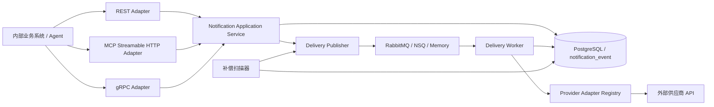

# 设计说明

## 架构图

Server 进程采用“一个业务内核，多个协议适配器”的方案：REST 和 MCP 共用 HTTP 监听器，MCP 使用独立精确路径 `/mcp`；原生 gRPC 使用独立 HTTP/2 监听器。三个入口只负责协议解码、鉴权和错误映射，统一调用 `internal/application/notification`，不允许 MCP 或 gRPC 绕行调用 REST。这样幂等判断、Provider Payload 校验、持久化和发布补偿语义只有一份实现。

## 1. 系统边界

### 1.1 选择解决的问题

本系统只解决内部业务消息向外部供应商的稳定投递：

- 接收并持久化业务系统提交的消息，持久化成功后异步处理，不让业务系统等待供应商响应。
- 每条消息只绑定一个 `provider_code + provider_action`，只执行一次目标动作，例如：`lark-bot/send`、`smtp-email/send`、`webhook/deliver` 或 `stripe/create_refund`。
- 使用 `source_system + source_request_id` 保证内部受理幂等，避免同一业务请求被重复创建。
- 以 PostgreSQL 作为消息状态的唯一事实来源，MQ 只负责通知 Worker 处理指定的 `event_id`。
- 负责供应商调用、超时控制、失败重试、限流、熔断、Worker 崩溃恢复和结果记录。
- 允许业务系统按自己的请求 ID 查询投递状态和经过脱敏、截断的供应商响应。
- REST、MCP 和 gRPC 暴露相同的提交、状态查询和 Provider 能力发现语义；Bearer Token 只认证服务访问，不代表 `source_system` 身份。

### 1.2 明确不解决的问题及原因

- 不支持一条消息投递多个供应商，也不处理部分成功、跨供应商事务和补偿编排。需要多个目标时，由来源系统提交多个独立请求。这样可以让一条数据库记录完整表达一次投递，保持状态和重试边界清晰。
- 不提供通用工作流、动态路由、动态脚本、模板平台或供应商版本管理。这些能力不属于“稳定消息投送和处理”的核心目标，引入后会显著增加配置、审计和运行复杂度。
- 不承诺供应商侧恰好一次处理。系统无法控制供应商是否支持幂等，也无法判断“供应商已经处理但响应丢失”的结果。
- 不保存完整的每次调用历史，只保留当前状态、最后一次执行结果和最近一次明确的供应商响应。当前目标是完成稳定投递和结果查询，而不是建设调用审计平台。
- 不在当前阶段引入独立的 Route、Endpoint、Task、Attempt、Outbox、Dead Letter 等通用平台模型。现阶段单消息、单目标的状态可由一张核心表完整表达。

## 2. 可靠性与失败处理

### 2.1 通知投递语义

系统选择的语义是：内部受理幂等，外部投递至少一次，不承诺外部恰好一次。

- 任一协议入口都只有在 PostgreSQL 成功提交消息后才返回受理成功；数据库提交失败时不返回成功。MCP 的 `submit_notification` 成功与 gRPC/REST 的 Accepted 含义一致，均不表示供应商已经投递成功。
- PostgreSQL 保存完整消息和处理状态，MQ 只传递 `event_id`，避免数据库与 MQ 出现两份不一致的业务数据。
- API 提交后未能发布 MQ、MQ 短暂故障或 Worker 崩溃时，补偿扫描和租约恢复会重新触发处理，避免消息静默丢失。
- Worker 通过数据库条件更新和租约原子领取任务；重复的 MQ 消息只有一个 Worker 能真正执行。
- 只有收到供应商的明确成功结果才将消息标记为成功。连接失败、超时、限流或供应商错误都按失败策略重新投递。
- “明确成功”只描述当前动作能够证明的边界：SMTP 在 `DATA` 阶段成功表示邮件服务器已接受，不表示最终送达；固定 Webhook 返回 HTTP `2xx` 表示端点已接受，不表示其后续业务处理完成。
- 如果供应商已经处理请求但响应在途中丢失，重试可能产生重复副作用。本系统选择降低漏送概率并接受这一风险；对于扣款、创建订单等非幂等动作，接入前必须使用供应商幂等键、查询或对账能力控制风险。

### 2.2 外部系统失败或长期不可用时的处理

- DNS、连接、超时、HTTP `408/429/5xx` 或供应商协议异常等未明确成功的结果进入 MQ 延迟重投，并按配置退避。
- 每个 `provider_code + provider_action` 独立限流和熔断。连续可用性失败达到阈值后熔断，暂停真实调用；开放期结束后只放行探测请求，避免持续冲击故障供应商。
- 待处理消息始终保留在 PostgreSQL。首次发布丢失、预期的 MQ requeue 丢失或 Worker 租约过期时，补偿扫描器会重新发布 `event_id`。
- `max_attempts` 包含首次真实供应商调用。达到上限仍未成功时标记为 `FAILED`，保留失败原因和最近一次明确响应，待外部系统恢复或配置修复后人工重放；配置为 `0` 时可持续重试。
- 熔断延期不计为真实供应商调用，避免供应商长期故障期间仅因等待而耗尽重试次数。

## 3. 取舍与演进

### 3.1 未采纳的过度设计

- 未采用一条消息广播到多个供应商的父子任务模型，因为当前约束是一条消息只有一个目标。
- 未拆分 Route、Endpoint、Task、Attempt、Outbox 和 Dead Letter 等多张表，因为单表已经能表达受理、投递、重试、租约和终态。
- 未让 MQ 携带完整 Payload，也未再生成独立 `message_id`，因为 `event_id` 已能定位 PostgreSQL 中的唯一事实。
- 未提供数据库驱动的任意 HTTP 方法、认证方式、动态脚本和通用模板；供应商语义由经过测试的 Adapter 代码负责，避免配置变成不可控的编程语言。
- `webhook/deliver` 只投递到启动配置中的固定 HTTPS 地址，Payload 不携带目标 URL，且不跟随重定向；这是受控 Adapter，不是任意 HTTP 代理。
- 未默认引入 Redis 分布式限流、共享熔断状态、缓存或复杂分区；这些能力只有在实际流量和多实例部署证明有需要时才增加。
- 未为不兼容 Payload 变化建立通用 Schema 版本平台；需要不兼容变化时新增明确的 Action，例如 `update_contact_status_v2`。

### 3.2 流量或复杂度增长后的演进

演进以实际指标和明确需求为触发条件，不预先平台化：

1. 单进程吞吐不足或需要独立扩缩容时，使用外部 MQ 分离 API 与 Worker，并按供应商或 Action 调整 Worker 并发。
2. 多个 Worker 必须共享严格的全局 QPS 时，再引入 Redis 等分布式限流；PostgreSQL 仍保存消息事实。
3. PostgreSQL 待发布扫描成为可测量的瓶颈时，再拆出独立 Outbox、使用 CDC 或按时间和状态分区。
4. 补偿扫描对数据库形成持续压力时，将补偿器从 API 和 Worker 进程中拆出，通常独立部署至少 3 个副本。副本之间使用 Raft 协议选举唯一 Leader，只有 Leader 执行数据库扫描和补偿发布，其他副本保持待命；Leader 故障后，只要多数副本可用，就自动选出新的 Leader 接管任务，从而保持一个活动补偿器并避免多个实例重复扫描数据库。Raft 只负责选主和故障接替，降低数据库压力仍需配合合理的扫描间隔、批量大小和索引。
5. 需要完整审计、逐次响应或重放依据时，再增加独立 Attempt 历史表；核心事件表继续保存当前状态。
6. 单个供应商持续影响其他供应商时，再按 `provider_code + provider_action` 拆分队列、消费组或 Worker 池。
7. 业务明确要求一条消息对应多个目标时，再引入父事件和子投递任务，并补充部分成功、补偿和查询语义。
8. 非幂等动作的重复副作用不可接受时，必须要求供应商幂等键或可确认结果的查询接口；无法获得这些能力时，不对该动作承诺自动可靠重试。
